# Enterprise ERP Business Process Flow Documentation

## Table of Contents
1. [Dashboard](#dashboard)
2. [Master Data](#master-data)
3. [Purchasing](#purchasing)
4. [Inventory](#inventory)
5. [Production](#production)
6. [Sales](#sales)
7. [Project Report](#project-report)
8. [Asset Management](#asset-management)
9. [User Management](#user-management)
10. [Notification](#notification)
11. [Overall ERP Flow](#overall-erp-flow)
12. [Cross Module Relationship](#cross-module-relationship)
13. [Database Relationship Summary](#database-relationship-summary)
14. [Permission Flow](#permission-flow)
15. [Document Flow](#document-flow)
16. [Architecture Summary](#architecture-summary)

---

## Dashboard

### 1. Overview
The Dashboard module acts as the central hub for users upon logging in. It provides a high-level overview of key performance indicators (KPIs), pending tasks, notifications, and recent activities.

### 2. Business Flow
1. User logs into the system.
2. System authenticates the user and checks permissions.
3. System fetches relevant KPIs, notifications, and activity logs based on the user's role.
4. User interacts with the dashboard widgets to navigate to specific modules.

### 3. Flowchart
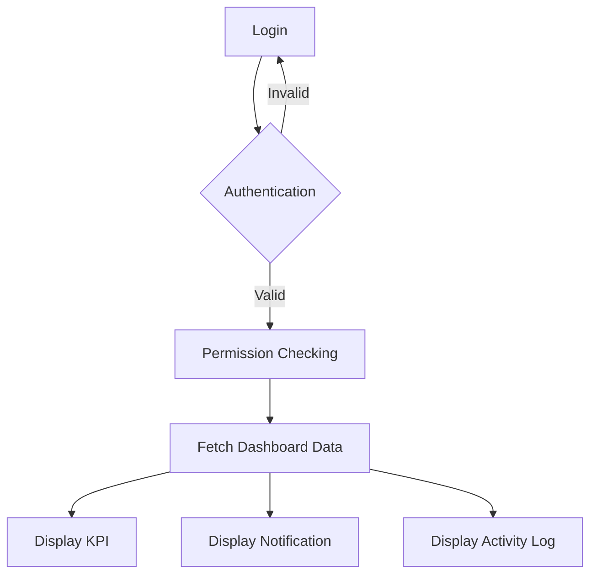

### 4. Input
- User Credentials (Username, Password).
- User Role and Permissions.

### 5. Process
- Authenticating user credentials against the database.
- Filtering dashboard data based on authorized scopes.

### 6. Output
- Visual KPI widgets (e.g., Total Sales, Pending POs).
- List of unread notifications.
- Recent activity timeline.

### 7. Related Modules
- User Management (Authentication & Authorization).
- Notification.
- All transactional modules (for KPI aggregation).

---

## Master Data

### 1. Overview
Master Data manages all core entities required by the ERP system to function, ensuring data consistency across transactions.

### 2. Business Flow
1. Administrator or authorized user accesses the Master Data section.
2. User creates, reads, updates, or deletes records (Products, Suppliers, Customers, etc.).
3. The system validates inputs (e.g., unique SKU for products).
4. Data is stored and becomes available for selection in transactional modules.

### 3. Flowchart
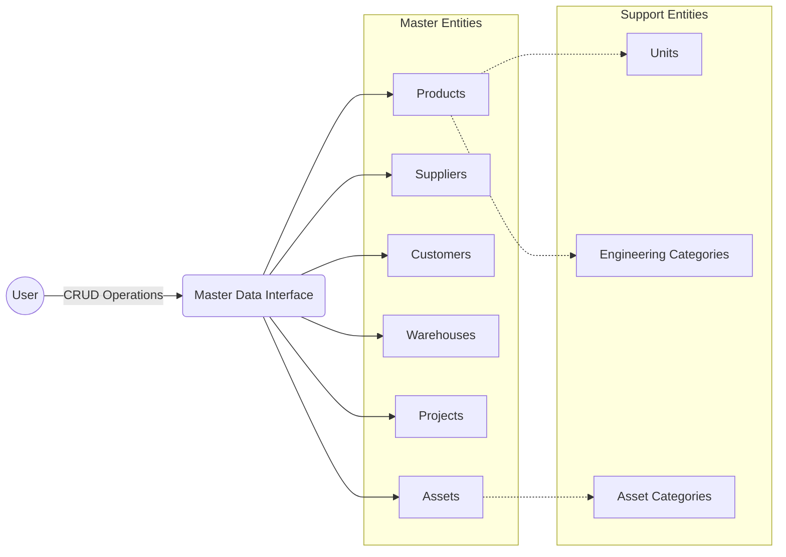

### 4. Input
- Entity details (e.g., Product Name, SKU, Supplier Address, Project Profile).

### 5. Process
- Validating data constraints (e.g., unique identifiers).
- Establishing relationships (e.g., linking a Product to an Engineering Category).

### 6. Output
- Centralized reference data used in dropdowns and relations across the ERP.

### 7. Related Modules
- Used by virtually all modules (Purchasing, Sales, Inventory, Production, Asset Management).

---

## Purchasing

### 1. Overview
The Purchasing module handles the procurement of goods and services, from order creation to receiving goods and settling payments.

### 2. Business Flow
1. A Purchase Request (optional) triggers the need for procurement.
2. A Purchase Order (PO) is created and approved, linked to a Supplier and potentially a Project.
3. Once goods arrive, a Goods Receipt (GR) is generated referencing the PO.
4. Stock is updated in the Inventory.
5. A Purchase Invoice is recorded against the GR.
6. A Purchase Payment is processed to clear Supplier Outstanding balances.

### 3. Flowchart
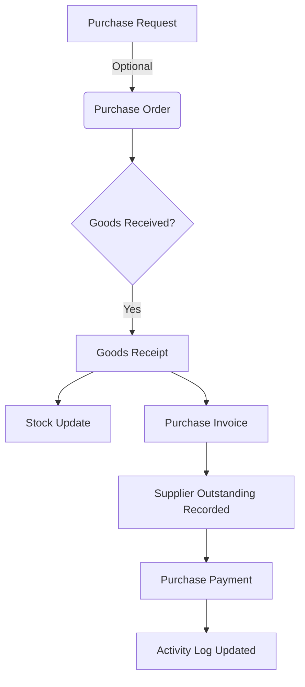

### 4. Input
- Selected Products, Supplier, Quantities, Prices.
- Goods delivery details.
- Payment details.

### 5. Process
- Calculating total PO values including taxes (PPN).
- Updating inventory balances upon GR.
- Calculating accounts payable (Outstanding).

### 6. Output
- Purchase Order Document.
- Goods Receipt Document.
- Updated Inventory Stock.
- Payment Records.

### 7. Related Modules
- Master Data (Suppliers, Products, Warehouses).
- Inventory (Stock Updates).
- Project Report (If PO is project-specific).

---

## Inventory

### 1. Overview
The Inventory module tracks the quantity, location, and movement of stock items across different warehouses.

### 2. Business Flow
1. Stock enters via Purchasing (Goods Receipt) or Production (Finished Goods).
2. Stock moves between warehouses via Transfer Stock.
3. Stock exits via Sales (Stock Reduction) or Production (Material Consumption).
4. Periodic Stock Opname is conducted to reconcile physical vs. system stock.
5. Inventory Adjustments handle discrepancies.
6. All movements are recorded in the Item Journal.

### 3. Flowchart
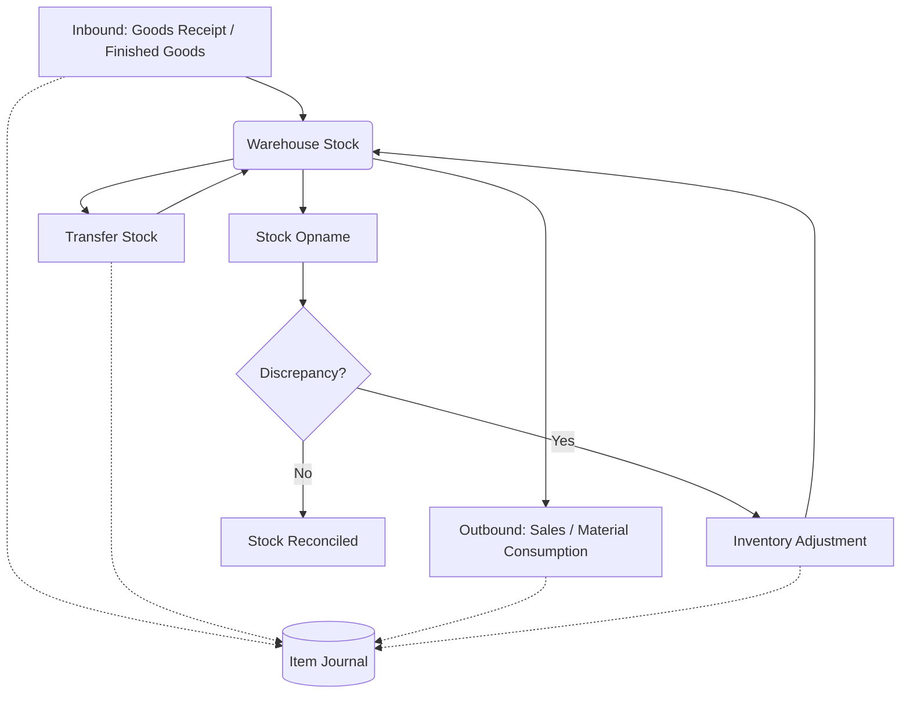

### 4. Input
- Item movements, physical counts (Opname), adjustment reasons.

### 5. Process
- Incrementing/Decrementing stock levels per warehouse.
- Recording absolute historical movements in the Item Journal.

### 6. Output
- Real-time stock levels.
- Item movement history (Journal).
- Discrepancy reports.

### 7. Related Modules
- Purchasing, Sales, Production, Master Data.

---

## Production

### 1. Overview
The Production module manages the transformation of raw materials into finished goods based on predefined formulas.

### 2. Business Flow
1. A Bill of Material (BOM) is defined for a finished product.
2. A Production Order is created based on the BOM.
3. Raw materials are consumed from Inventory (Material Consumption).
4. The production process occurs.
5. Finished Goods are yielded and added to Inventory stock.

### 3. Flowchart
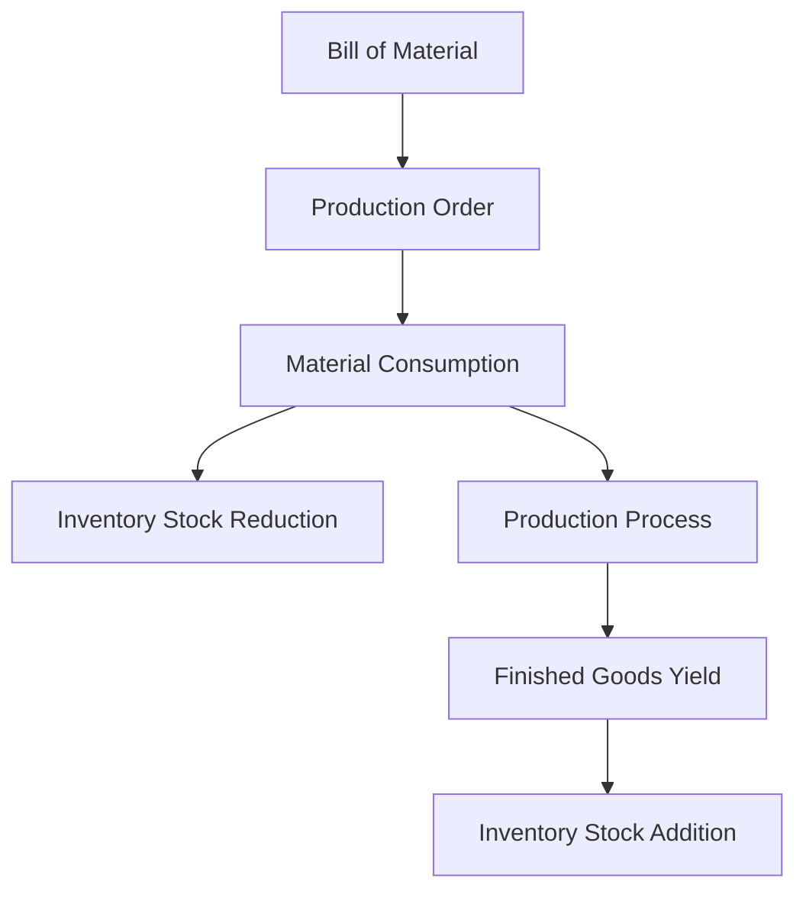

### 4. Input
- Production target quantities.
- Selected BOM.

### 5. Process
- Calculating required raw materials based on BOM.
- Deducting raw materials from stock.
- Adding finished goods to stock.

### 6. Output
- Production Orders.
- Material Issue documents.
- Production Result documents.

### 7. Related Modules
- Master Data, Inventory.

---

## Sales

### 1. Overview
The Sales module handles the process of selling goods or services to customers, managing orders, invoicing, and receivables.

### 2. Business Flow
1. A Sales Order (SO) is created for a Customer.
2. Goods are delivered, reducing Inventory Stock.
3. A Sales Invoice is generated based on the delivery.
4. Accounts Receivable is updated.
5. Customer makes a Sales Payment, clearing the receivable.

### 3. Flowchart
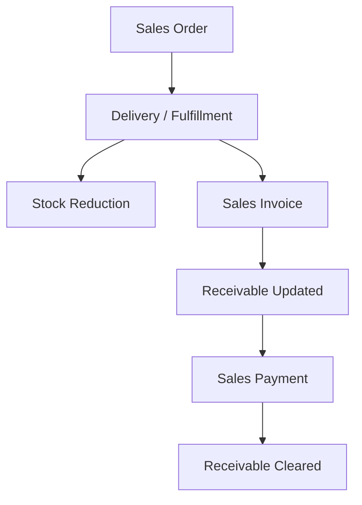

### 4. Input
- Customer details, Products, Quantities, Pricing, Payment Terms.

### 5. Process
- Reserving/deducting stock.
- Calculating totals and taxes.
- Tracking aging receivables.

### 6. Output
- Sales Order Document.
- Invoice.
- Payment Receipt.

### 7. Related Modules
- Master Data (Customers, Products).
- Inventory.

---

## Project Report

### 1. Overview
The Project Report module tracks the execution and progress of ongoing projects, including documentation, resource usage, and financial tracking (HPP).

### 2. Business Flow
1. A Survey Report initiates the project assessment.
2. Project Progress is periodically updated.
3. Daily Reports are submitted by field engineers.
4. Report Phases (BAPP) are generated to signify milestone completions, requiring multi-party signatures.
5. Material Usage is summarized categorized by Engineering Categories (Civil, Mechanical, Electrical).
6. HPP (Harga Pokok Penjualan) Summary calculates the total cost vs. margin.

### 3. Flowchart
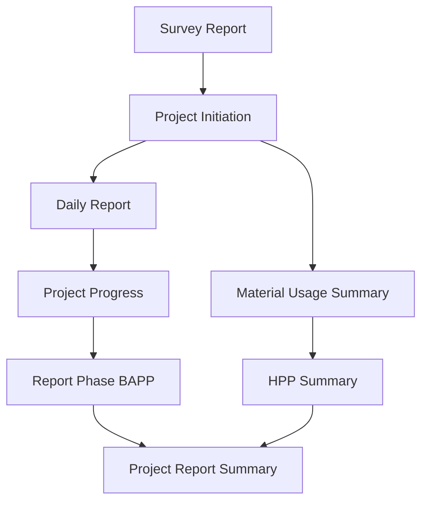

### 4. Input
- Daily field activities, progress percentages.
- Signer details for Report Phases.
- Consumed materials linked to the project.

### 5. Process
- Aggregating daily reports into overall progress.
- Categorizing material costs by Engineering Category.
- Calculating HPP without altering core inventory logic.

### 6. Output
- Printed Daily Reports.
- Printed Report Phase (BAPP) PDFs.
- Financial HPP Summaries.

### 7. Related Modules
- Master Data (Projects, Engineering Categories).
- Purchasing/Inventory (for Material Costs).

---

## Asset Management

### 1. Overview
Manages the lifecycle of company assets, including acquisition, maintenance, movement, and depreciation.

### 2. Business Flow
1. Asset Registration introduces a new asset.
2. Asset is assigned to a location or user (Asset Movement).
3. Routine Asset Maintenance or Asset Improvements are recorded, potentially increasing asset value.
4. The system calculates Depreciation over time.
5. Asset Reports summarize current valuations and conditions.

### 3. Flowchart
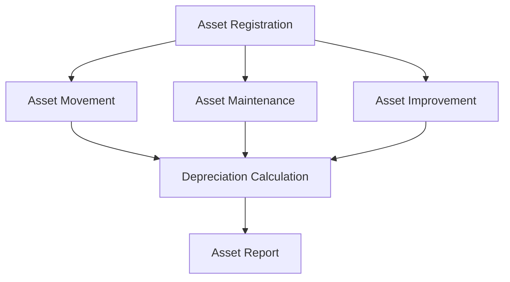

### 4. Input
- Asset details, purchase value, useful life, maintenance records.

### 5. Process
- Calculating straight-line or declining balance depreciation.
- Tracking location history.

### 6. Output
- Asset Register.
- Depreciation Schedule.
- Maintenance Logs.

### 7. Related Modules
- Master Data (Assets, Asset Categories).
- Purchasing (Asset Acquisition).

---

## User Management

### 1. Overview
Controls system access, ensuring users only see and interact with modules they are authorized for.

### 2. Business Flow
1. Administrator creates Users and assigns Roles.
2. Roles are configured with specific Permissions via a Permission Matrix.
3. Users authenticate (Login).
4. The system enforces Authorization on menus and actions (CRUD).
5. All sensitive actions generate Activity Logs.

### 3. Flowchart
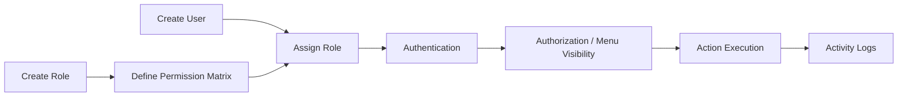

### 4. Input
- User details, passwords, role assignments.

### 5. Process
- Hashing passwords.
- Middleware checking route permissions.

### 6. Output
- Secure system access.
- Audit trails.

### 7. Related Modules
- Dashboard.
- Notification.

---

## Notification

### 1. Overview
Alerts users to important events, pending approvals, or system updates.

### 2. Business Flow
1. A system event acts as a Notification Trigger (e.g., new PO requires approval).
2. The notification enters the Notification Queue.
3. The Notification Display renders it on the targeted user's UI.
4. User marks it as Read or leaves it Unread.

### 3. Flowchart
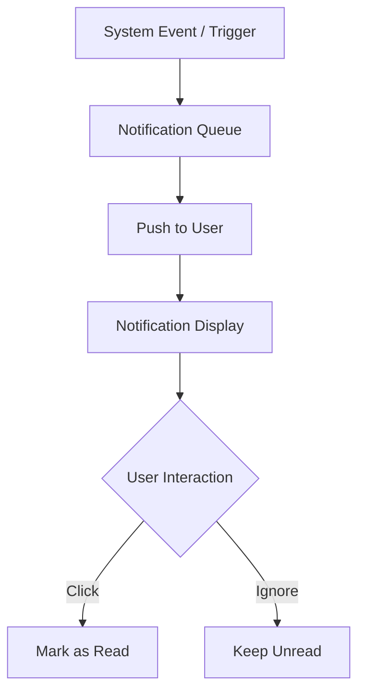

### 4. Input
- Trigger events, target user IDs, message content.

### 5. Process
- Queuing and broadcasting (if real-time).

### 6. Output
- UI alerts, dropdown notifications.

### 7. Related Modules
- All transactional modules (as triggers).
- User Management.

---

## Overall ERP Flow

This diagram illustrates the macro-level end-to-end business process of the ERP system, from initial project survey down to management reporting.

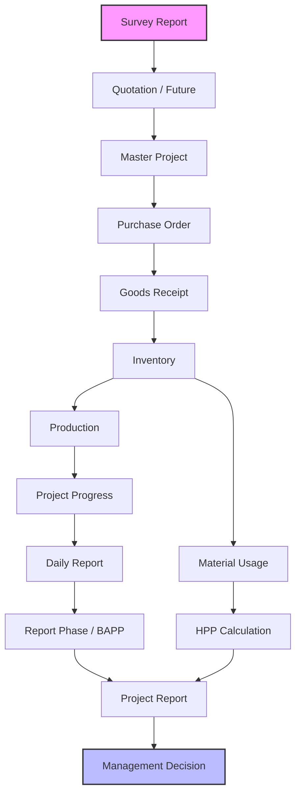

---

## Cross Module Relationship

This diagram illustrates how data flows logically across the core architectural modules.

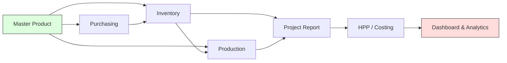

---

## Database Relationship Summary

### Concept and Architecture
The ERP database is highly relational, ensuring data integrity through foreign keys and cascading constraints.

**Main Tables:**
- **Master Tables:** `users`, `products`, `suppliers`, `customers`, `projects`, `warehouses`.
- **Transactional Tables:** `purchase_orders`, `goods_receipts`, `sales_orders`, `report_phases`, `daily_reports`, `item_journals`.
- **System Tables:** `roles`, `permissions`, `activity_log`, `notifications`.

**Foreign Keys & Relationships:**
- **Product Centrality:** Transactional detail tables (e.g., `purchase_order_details`, `goods_receipt_details`) always reference `product_id`.
- **Project Tracking:** Modules like Purchasing and Report Phases reference `project_id` to aggregate costs and progress.
- **Audit Trails:** Almost all transactional tables contain `created_by` linking to the `users` table to maintain accountability.

**Data Flow (Conceptual):**
When a PO is received, a GR record is created linking to the PO ID. The GR details map to Product IDs. This triggers a write to the `item_journals` table referencing the Product ID and Warehouse ID, effectively increasing the conceptual stock balance calculated dynamically or stored in a `stocks` summary table.

---

## Permission Flow

How a user navigates and gains access to features based on security constraints.

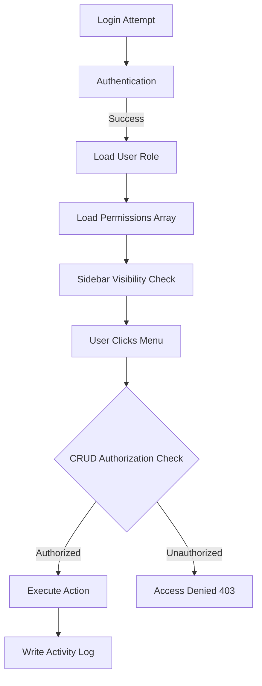

---

## Document Flow

The lifecycle of business documents moving through the supply chain and financial tracking.

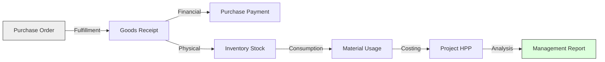

---

## Architecture Summary

### System Architecture Overview
The ERP is built using a modern MVC (Model-View-Controller) architecture, structured in defined layers to ensure separation of concerns and maintainability.

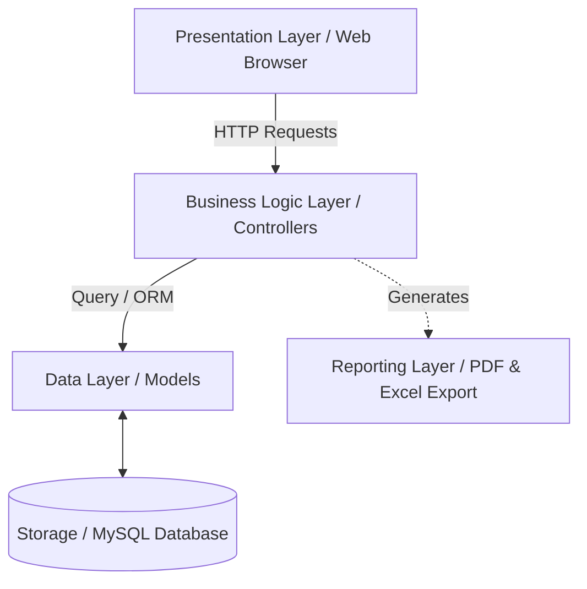

### Layer Details
1. **Presentation Layer (View):** Built with Blade templates, HTML, CSS, and JavaScript. Handles user interaction, dynamic UI changes (like adding multiple signers), and client-side validation.
2. **Business Logic Layer (Controller):** PHP Controllers handle request validation, encapsulate business rules (e.g., verifying stock before sales, calculating HPP), and orchestrate data flow.
3. **Data Layer (Model):** Eloquent ORM defines relationships, accessors, and mutators. It manages soft deletes, timestamps, and audit trail hooks.
4. **Storage (Database):** A relational SQL database ensuring ACID compliance.
5. **Reporting Layer:** Specialized services and views dedicated to rendering printable documents (BAPP, Daily Reports) and financial summaries.

### Inter-Module Communication
Modules communicate primarily through shared Database state and Service Classes. For instance, when the Purchasing module records a Goods Receipt, it invokes Inventory services or directly writes to the `item_journals` table. Events and Listeners are utilized for decoupled actions, such as triggering Notifications or logging Activities when a transaction is finalized.