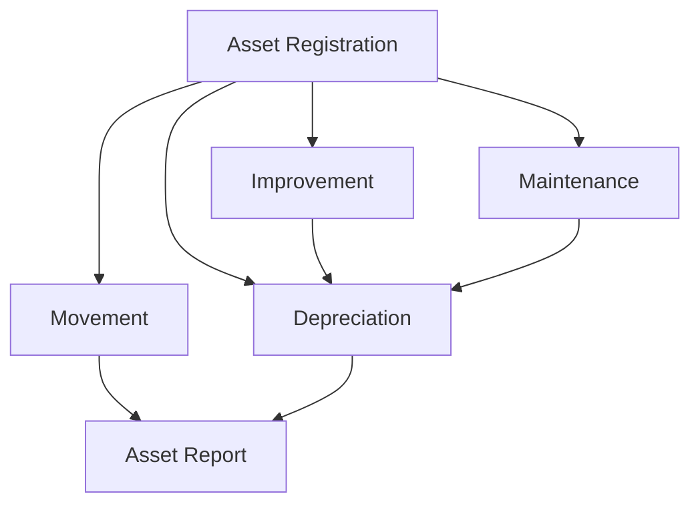

# Asset Management Flow

This diagram tracks the lifecycle of company assets from acquisition to depreciation and reporting.

## Notes
- Improvements and Maintenance can affect the overall valuation and Depreciation calculations of the asset.
- Asset Movement records track the physical location or assignment of the asset.
