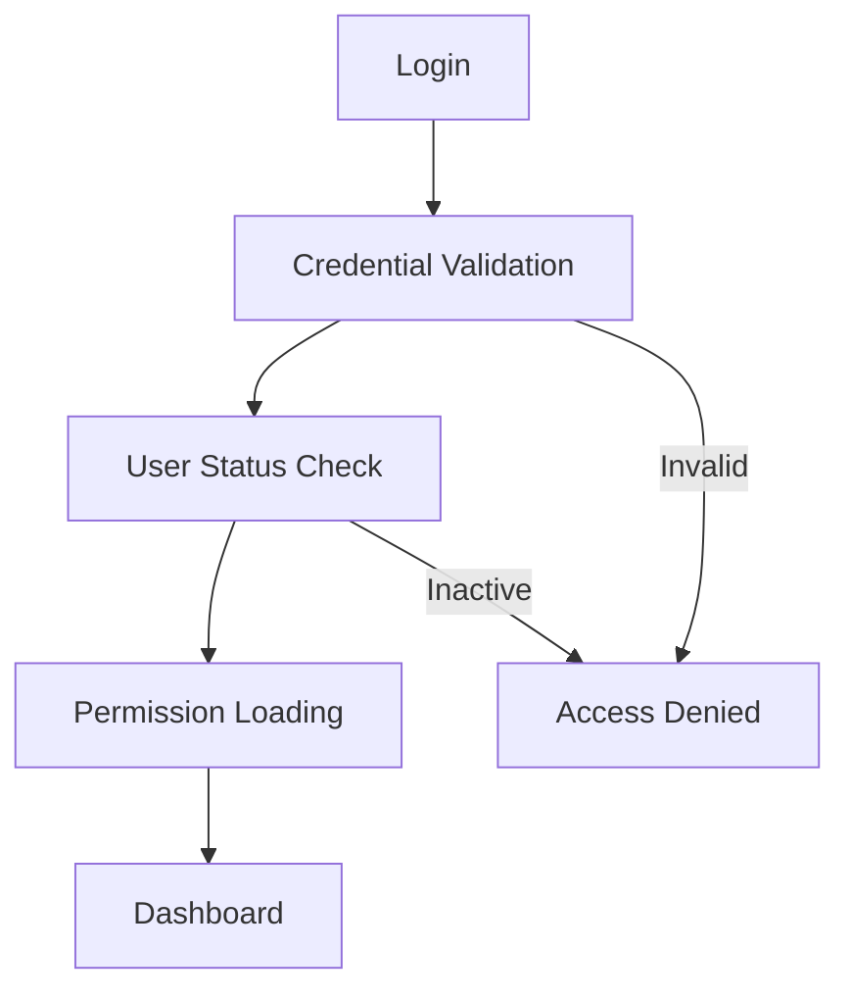

# Authentication Flow

This diagram focuses specifically on the logic flow when a user attempts to log into the ERP.

## Notes
- The User Status Check ensures that deactivated or suspended users cannot enter the system, even with correct credentials.
- After successful validation, the system caches or loads Permissions for the current session.
