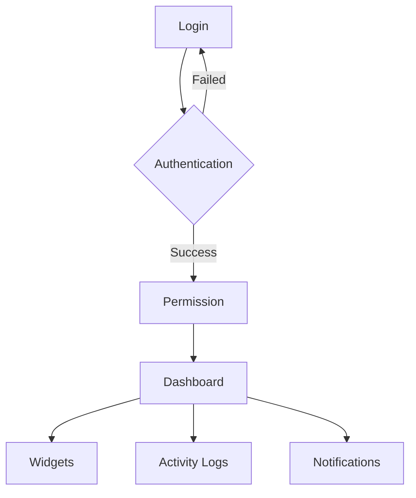

# Dashboard Flow

This diagram illustrates the user login and dashboard interaction flow, including authentication, permission checking, and subsequent dashboard widgets.

## Notes
- Users must successfully authenticate to reach the permission check.
- Widgets displayed are contextual based on the user's role and permissions.
