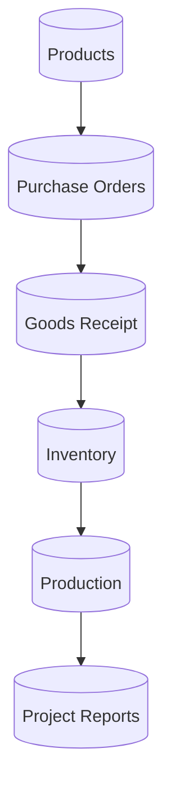

# Database Relationship Flow

This diagram provides a conceptual Entity-Relationship (ER) flow, illustrating how primary tables link to one another to track data.

## Notes
- This is a conceptual flow and does not represent direct SQL foreign keys 1:1, but rather how data structurally cascades.
- Products act as the central anchor for transactional records (PO, GR, Inventory movements).
