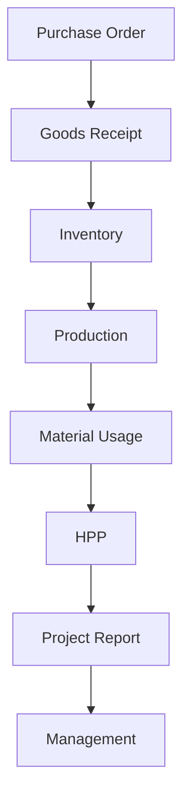

# Document Flow

This diagram traces the lifecycle and transformation of core business documents throughout the supply chain and financial tracking.

## Notes
- The Purchase Order is the initiating document for procurement.
- Goods Receipt confirms the physical and financial liability of the PO, updating Inventory.
- Material Usage deducts from Inventory and feeds into HPP (Harga Pokok Penjualan) calculation.
