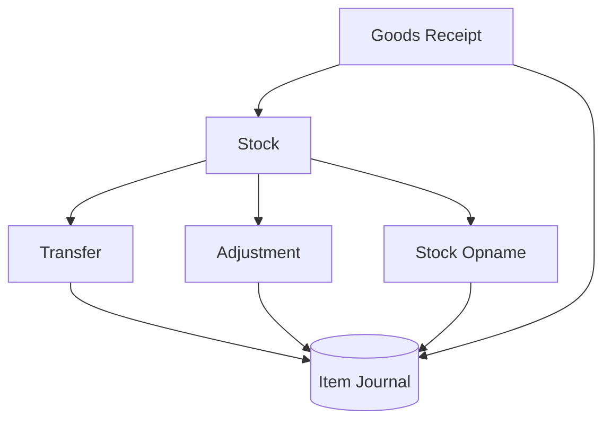

# Inventory Flow

This diagram shows how inventory items move through the system, from receipt to stock management and adjustments.

## Notes
- All physical and system stock movements (Receipt, Transfer, Adjustment, Opname) are recorded historically in the Item Journal.
