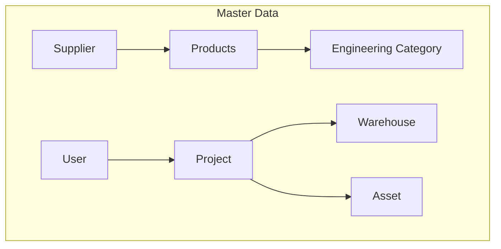

# Master Data Flow

This diagram shows the hierarchy and relationships of Master Data entities within the ERP system.

## Notes
- Products are categorized by Engineering Categories.
- This is a conceptual relationship representing how master data is structured and linked.
