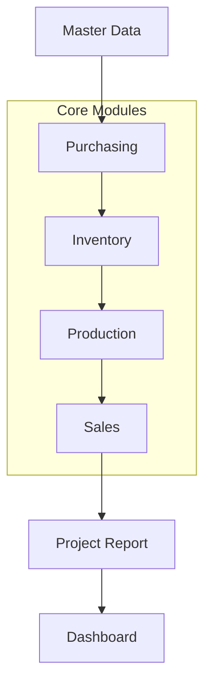

# Module Relationship Diagram

This diagram illustrates how data flows logically across the core architectural modules of the ERP.

## Notes
- Master Data is the foundational layer accessed by all core modules.
- Purchasing feeds Inventory, which in turn supplies Production and Sales.
- The Dashboard aggregates data from Project Reports and Core Modules.
