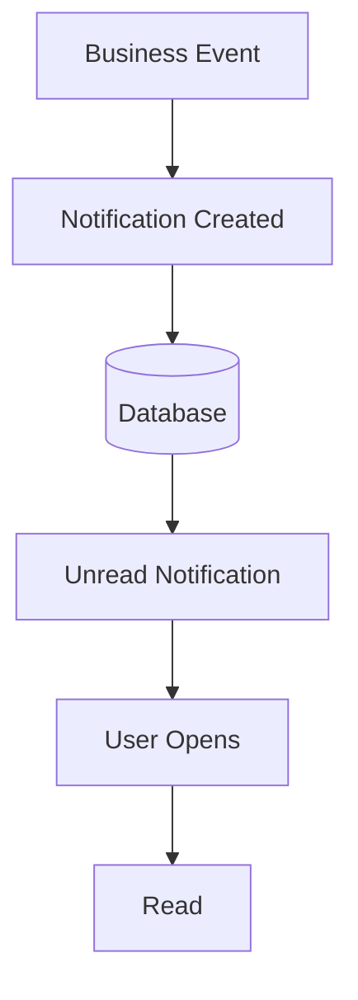

# Notification Flow

This diagram demonstrates the lifecycle of a system notification, from the triggering event to the user acknowledging it.

## Notes
- Business Events (e.g., PO awaiting approval) automatically generate Notifications.
- The UI polls or receives push events to show Unread Notifications.
