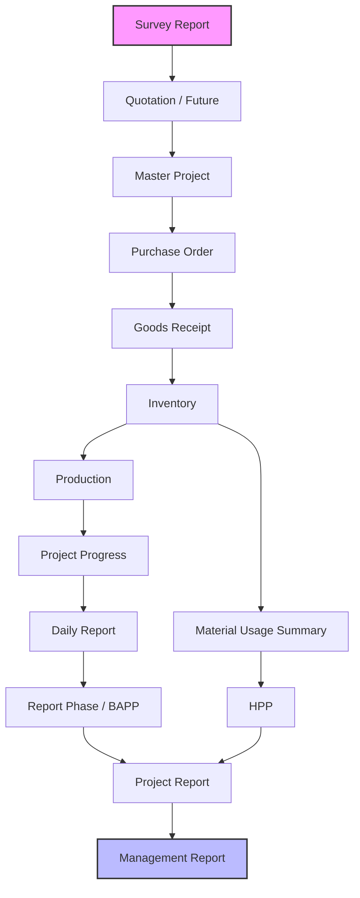

# Overall System Flow

This diagram shows the complete ERP workflow, covering the macro-level end-to-end business process from initial project survey down to management reporting.

## Notes
- Quotation is marked as a future expansion.
- Project Progress relies on Production and Inventory data.
- HPP (Harga Pokok Penjualan) and Project Report feed into final Management Reports.
