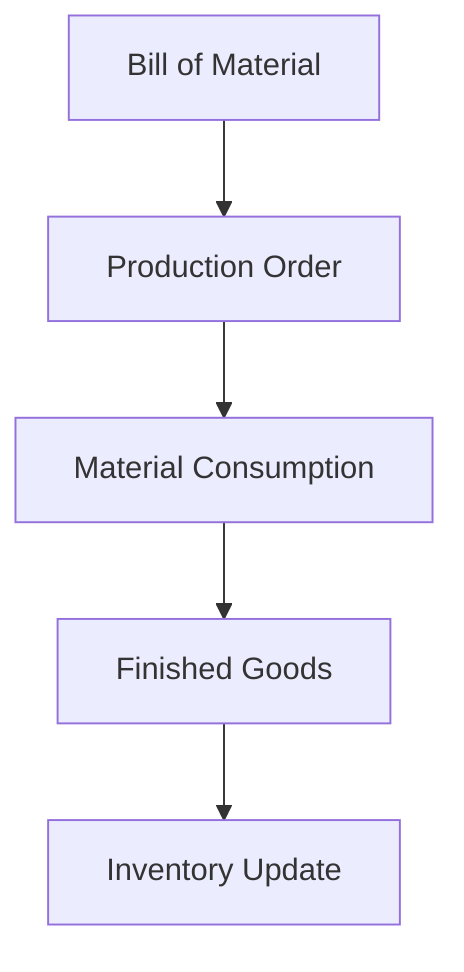

# Production Flow

This diagram outlines the process of converting raw materials into finished goods through production orders based on a Bill of Material (BOM).

## Notes
- Material Consumption decreases raw material inventory.
- Finished Goods increases product inventory.
