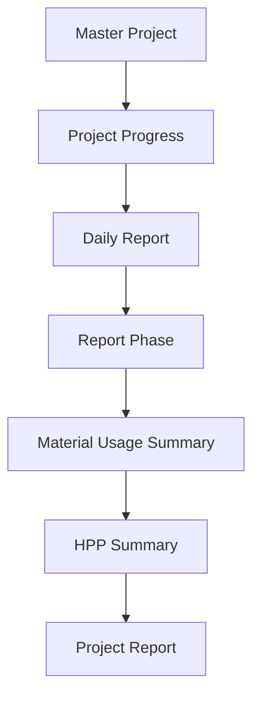

# Project Report Flow

This diagram captures the ongoing tracking of project execution, linking field reports to material usage and final cost summaries (HPP).

## Notes
- Report Phase (BAPP) represents milestone completions based on the compiled Daily Reports.
- HPP (Harga Pokok Penjualan) Summary aggregates the categorized material costs for financial overview.
