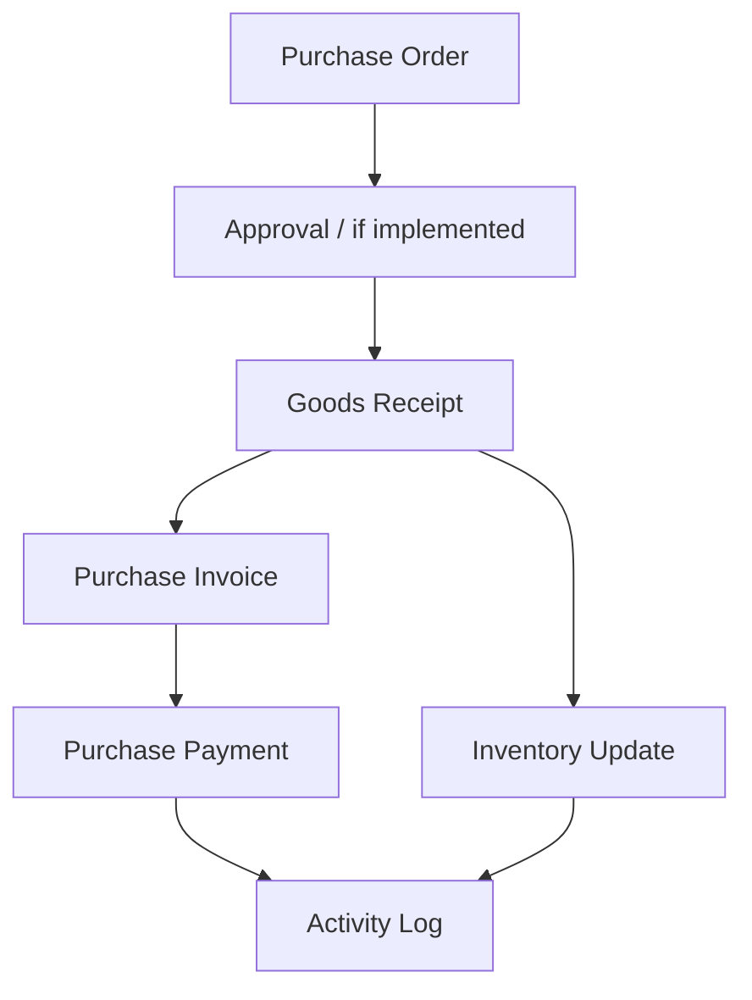

# Purchasing Flow

This diagram maps out the procurement process from issuing a Purchase Order to recording the payment and updating inventory.

## Notes
- Goods Receipt triggers an Inventory Update concurrently with the financial tracking (Invoice & Payment).
- Actions performed are recorded in the Activity Log for audit trails.
