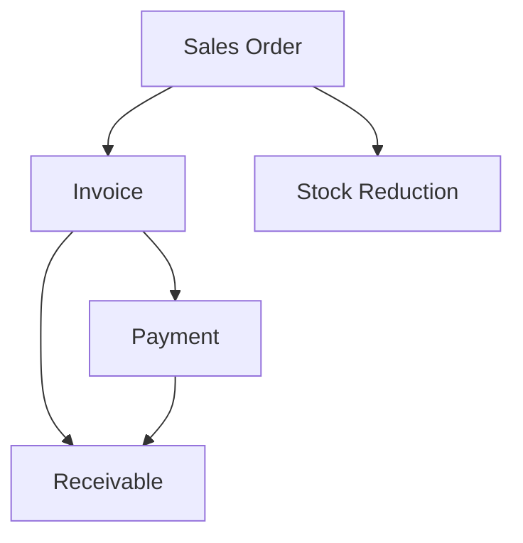

# Sales Flow

This diagram illustrates the order-to-cash process, covering sales orders, fulfillment, invoicing, and payment collection.

## Notes
- Sales Order fulfillment triggers a Stock Reduction in the Inventory module.
- Payments clear outstanding Receivables.
