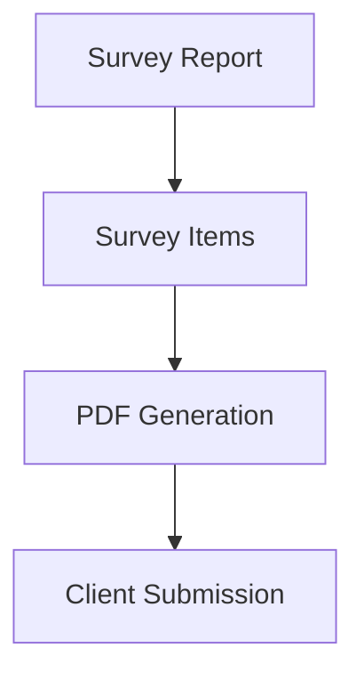

# Survey Report Flow

This diagram details the pre-sales process of conducting a site survey and preparing it for the client.

## Notes
- This is an independent module and is part of the pre-sales process.
- It is NOT directly connected to the Master Project at this stage.
