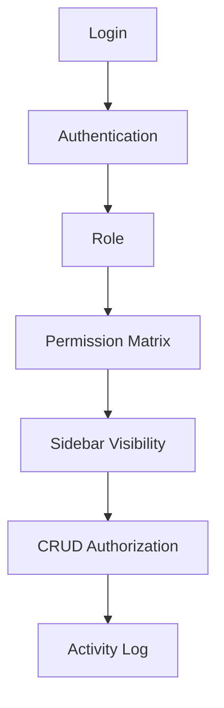

# User Management Flow

This diagram illustrates how users are provisioned, authenticated, and authorized to perform actions within the ERP system.

## Notes
- Roles group multiple Permissions together.
- Sidebar Visibility and CRUD (Create, Read, Update, Delete) limits are dictated by the assigned Role's Permission Matrix.
- Any authorized CRUD action creates an entry in the Activity Log for audit trailing.
